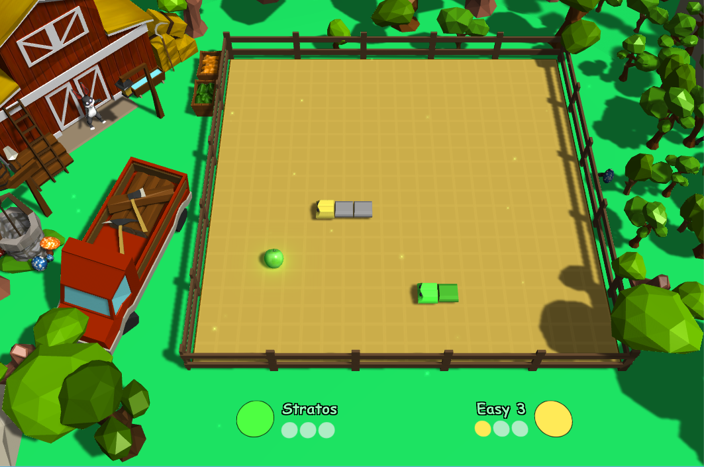

This project is the implementation of my graduation thesis "Developing a 3D video game using Artificial Inteligence techniques".
The idea was to upgrade the classic Snake experience by introducing up to 3 AI enemies for the player.

[Live Demo Here](https://kisamegr.github.io/Thesis-Project-Snake/)

## Multiple player Snake Game 
The game consists of a grid/map of discrete cells, the players and a randomly spawned food. 
* The players spawn on the corners of the map, starting with only the head of their snake occupying only one cell.
* Eating the food makes your snake longer by one cell, giving you an advantage over your enemies.
* The snake moves straight continuously (according to the game speed) and you can only turn left or right to change direction. 
* You lose when you collide your head with either the wall or a snake's body (even yours as well!)
* The goal is to be the last snake standing, eliminating your enemies in the process.

## AI using MiniMax with A-B Prunning

The game is running on a discrete time step. In each step, each player makes a valid move: turn left, turn right, or do nothing.
At first glance, it seems that the snakes are moving simultaneously, but they are actually acting sequentially, and their 
action is applied simultaneously at the end of the timestep.

Hence, each step can be divided into states. 
A state consists of:
* Which player's turn is to move their snake.
* What action did that player take.
* The updated state of the map/grid at that timestep after the player made their move.

The MiniMax algorithm is used for 2-Player games, in which the players are competing with each other.
The basic idea behind the MiniMax algortithm can be summarized into 3 distinct functions:
1. For every enemy, generate a tree of states until a given depth, alternating between actions of the player and the enemy itself.
2. Evaluate the leaf nodes (the deepest level states) with a set of criteria.
3. Traverse the tree in a down-top manner to find which is the best-case-scenario action to take.

